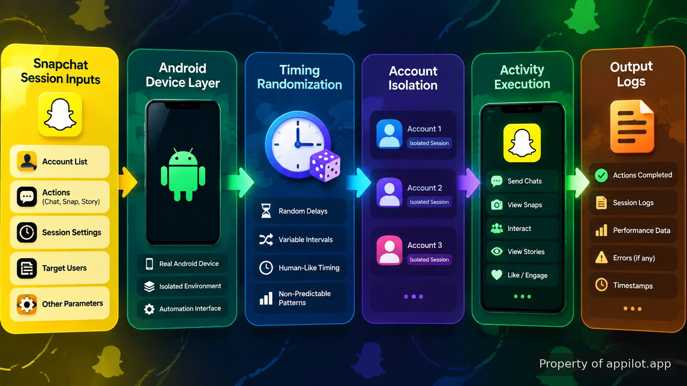

<p align="center">
  <a href="https://www.appilot.app/store/snapchat-snapscore-increase-bot-pacing" target="_blank" rel="nofollow">
    
  </a>
</p>

## snapscore bot

Rapid, repeated Snapchat actions can look unlike normal human behavior. A snapscore bot has to solve a timing and session-management problem, not just send actions in sequence. This repository documents the architecture of a system designed around pacing, variance, device-level sessions, and account separation. It explains the engineering model used to run controlled Snapchat activity patterns without presenting a working clone or a copy-and-run script.

> A session-aware automation design built around timing, isolation, and repeatable device behavior.

The main challenge is avoiding a fixed pattern where every action happens at identical intervals from the same environment. The design treats timing rules, device state, and account boundaries as first-class parts of the workflow. A production deployment is maintained separately; this repository focuses on the architecture and implementation concepts behind the system.

<a href="https://www.appilot.app/store/snapchat-snapscore-increase-bot-pacing" target="_blank" rel="nofollow">
  
</a>

<p align="center">
  <a href="https://t.me/Bitbash333" target="_blank" rel="nofollow">
    
  </a>&nbsp;
  <a href="https://wa.me/923249868488?text=Hi%2C%20I%27m%20interested." target="_blank" rel="nofollow">
    
  </a>&nbsp;
  <a href="mailto:hello@appilot.app" target="_blank" rel="nofollow">
    
  </a>&nbsp;
  <a href="https://www.appilot.app" target="_blank" rel="nofollow">
    
  </a>
</p>



## Why pacing and variance matter

Automation systems often fail when they behave like a script replaying the same sequence. A fixed delay, identical action order, and shared session state create a predictable pattern. This design separates the action engine from the timing layer so that schedules can include controlled variation instead of a single repeated interval.

The timing layer can be modeled around ranges rather than one constant value. For example, a workflow may define an allowed delay window between actions instead of forcing every event to happen after the same number of seconds. The exact values depend on the production configuration and operating requirements.

This approach follows a broader automation principle: systems interacting with user-facing applications need state management and realistic execution flows. The <a href="https://developer.android.com/docs" target="_blank" rel="nofollow">Android developer documentation</a> provides the platform foundation for understanding application behavior, device states, and supported Android development patterns.

## Android automation architecture

The system uses an Android automation bot structure where device actions, account sessions, and scheduling rules are separated. The separation makes it easier to identify failures because a session problem does not become mixed with the timing engine or logging layer.

| Component | Description |
| --- | --- |
| Session Controller | Maintains separate device sessions and prevents shared account state from mixing. |
| Timing Engine | Applies configurable pacing rules and variable delays between activity steps. |
| Device Layer | Handles Android-side execution and interaction with the running environment. |
| Activity Logger | Records execution events, failures, and session information for review. |
| Isolation Manager | Keeps multiple account environments separated during operation. |

The architecture is intentionally split into smaller responsibilities. When an execution issue appears, logs can show whether the cause came from scheduling, a device state change, or a session boundary. This makes maintenance easier than debugging one large automation sequence.

## Multi account isolation design

Running multiple Snapchat accounts introduces a state-management challenge. A shared environment can accidentally mix sessions, credentials, or stored application data. Multi account isolation separates those contexts so each account operates inside its own controlled environment.

The design treats each account as an independent execution unit with its own session lifecycle. A scheduler assigns work to a specific environment, the device layer performs the required action sequence, and the logger records the result without merging unrelated account activity.

- Separate account sessions reduce accidental cross-account state sharing.
- Device-level boundaries make debugging individual runs easier.
- Execution records provide visibility into completed and failed actions.

<a href="https://tally.so/r/yP5oDx?platform=GitHub&amp;format=Product+repo&amp;brand=Appilot&amp;niche=appilot&amp;page=Snapscore+Bot+for+Android+Devices&amp;date=2026-09-08" target="_blank" rel="nofollow">
  
</a>

## Snapchat automation workflow

The complete workflow moves through preparation, controlled execution, and logging. The system is not designed as a simple command repeater; each run passes through state checks before activity begins.

| Stage | Process |
| --- | --- |
| Session preparation | Loads the selected device environment and confirms the assigned account context. |
| Schedule evaluation | Applies pacing rules before the next permitted activity step. |
| Device execution | Runs the configured interaction sequence through the Android environment. |
| Result capture | Stores execution information for later inspection and troubleshooting. |

A typical failure mode is an automation flow that ignores context and executes every action immediately. This architecture removes that failure point by placing scheduling and session checks before execution. The result is a workflow that can be inspected instead of a sequence of hidden clicks.

## Core Features

| Feature | Description |
| --- | --- |
| Variable Timing Controls | Removes fixed execution patterns by managing delays and pacing rules between actions. |
| Device Session Handling | Prevents unclear execution states by keeping device interactions tied to defined sessions. |
| Multi Account Isolation | Avoids mixed account contexts by separating environments and session ownership. |
| Execution Logging | Removes guesswork during debugging by recording workflow events and failures. |
| Android Device Automation | Provides the device-side layer required for controlled application interactions. |

## Repository setup and runtime

The project layout keeps configuration, execution logic, and device communication separated. A production installation uses the required runtime environment and device connections before scheduled activity begins.

```text
snapscore-automation-system/
├── src/
│   ├── scheduler/
│   │   └── timing_engine.py
│   ├── device/
│   │   └── android_controller.py
│   ├── sessions/
│   │   └── isolation_manager.py
│   └── logging/
│       └── activity_logger.py
├── config/
│   └── settings.yaml
├── requirements.txt
└── README.md
```

```bash
git clone repository
cd snapscore-automation-system
pip install -r requirements.txt
python src/main.py
```

The repository structure is a reference implementation layout. Actual production deployments can include additional device management, monitoring, and operational controls depending on the environment.

## How to Run snapscore bot

- **STEP 1 — Download & Set Up the Project** Download the repository, install dependencies, and configure snapscore bot before connecting the Android execution environment.
- **STEP 2 — Open Session Manager** Start the application and access the session controls used to select the required device environment.
- **STEP 3 — Configure Activity Rules** Set timing ranges, account assignments, and execution parameters through the available configuration fields.
- **STEP 4 — Start Run and Review Logs** Trigger the execution process, then inspect activity records and session results.

## Use Cases

- Managing controlled Android-based Snapchat activity where timing consistency must be reviewed and adjusted.
- Testing session separation approaches for applications that require multiple isolated environments.
- Building internal automation workflows where execution history and device state records are required.

## Technical references

The implementation concepts rely on standard platform documentation rather than undocumented behavior. Android developers can review the official <a href="https://developer.android.com/guide/topics/ui/accessibility" target="_blank" rel="nofollow">Android accessibility documentation</a> and <a href="https://developer.android.com/training/testing" target="_blank" rel="nofollow">Android testing documentation</a> when designing device interaction systems.

Application automation also depends on respecting platform rules and account safety requirements. Snapchat publishes information about its platform through its <a href="https://developers.snap.com/" target="_blank" rel="nofollow">developer resources</a> and community guidance. Security practices for account systems can also be compared with the <a href="https://cheatsheetseries.owasp.org/cheatsheets/Authentication_Cheat_Sheet.html" target="_blank" rel="nofollow">OWASP Authentication Cheat Sheet</a>.

## FAQ

### How does the tool handle Snapchat activity patterns?

The architecture handles activity patterns through timing controls, session separation, and execution logging. It avoids a single fixed sequence by treating pacing and state management as separate parts of the workflow.

### Can this run across multiple accounts?

The design includes multi account isolation so separate account environments can be managed independently. Each session has its own execution context and recorded activity history.

### Is this a complete working clone or an architecture reference?

This repository documents the architecture and engineering approach rather than providing a complete clone with a ready-to-run production script. Production versions require their own deployment configuration and operational controls.

<table>
  <tr>
    <td align="center" width="33%">
      
      <p>This scraper helped me gather thousands of posts effortlessly. The setup was fast, and exports are super clean and well-structured.</p>
      <p><b>Nathan Pennington</b><br>Marketer<br>★★★★★</p>
    </td>
    <td align="center" width="33%">
      
      <p>What impressed me most was how accurate the extracted data is. Likes, comments, timestamps — everything aligns perfectly.</p>
      <p><b>Greg Jeffries</b><br>SEO Affiliate Expert<br>★★★★★</p>
    </td>
    <td align="center" width="33%">
      
      <p>It's by far the best tool I've used. Ideal for trend tracking, competitor monitoring, and influencer insights.</p>
      <p><b>Karan</b><br>Digital Strategist<br>★★★★★</p>
    </td>
  </tr>
</table>